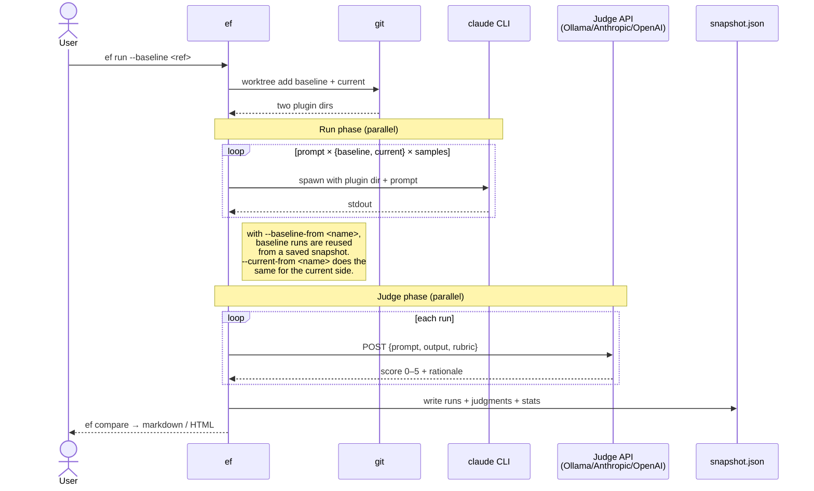
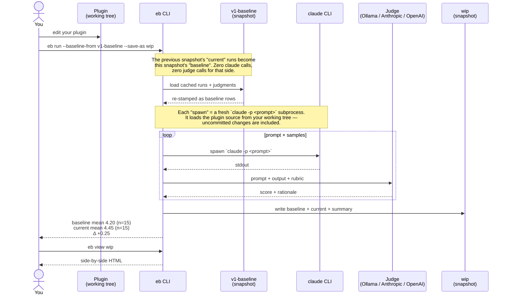
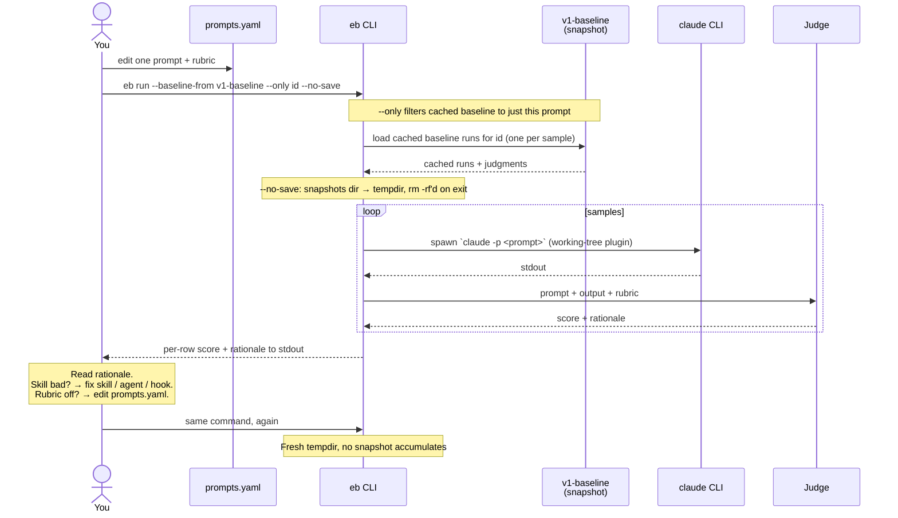
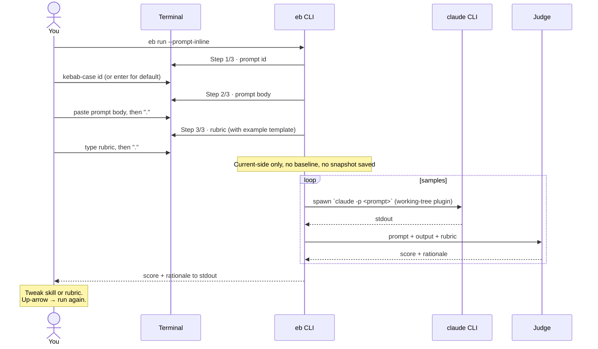

# eval-bench

Benchmark Claude Code plugins by A/B comparing plugin versions with LLM-judged evaluation prompts.

Runs a fixed set of prompts against two versions of your plugin (baseline vs current), invokes the real `claude` CLI so skills, MCP servers, subagents, slash commands, and hooks actually load, grades each output with a configurable judge (local Ollama, Anthropic, OpenAI, or any OpenAI-compatible endpoint), and produces a side-by-side comparison.

## How it works



The provider (`claude` CLI) and judge (HTTP API) are independent — the judge never sees `claude`, only the captured output and your rubric.

## Install

```bash
npm i -g eval-bench
# or
npx eval-bench --help
```

Requires:
- Node 20+
- `claude` CLI on PATH ([install instructions](https://docs.anthropic.com/claude-code))
- Your plugin in a git repo (required for baseline checkout via `git worktree`)
- A judge: either Ollama installed locally, or an API key for Anthropic/OpenAI

**Note:** You don't need a full plugin structure—if you only have standalone `skills/*.md` or `agents/*.md` files without `.claude-plugin/plugin.json`, eval-bench will automatically create a temporary minimal plugin manifest for you.

## Quickstart

```bash
cd my-claude-plugin

# scaffold .eval-bench/ (config, prompts template, snapshots dir)
eb init

# write your eval prompts and rubrics
$EDITOR .eval-bench/prompts.yaml

# freeze a reference snapshot at a known-good ref. This becomes the
# starting point for the rolling-baseline workflow below.
eb eval --ref v1.0.0 --save-as v1-baseline
```

From here you'll typically use one of three workflows. Pick by what you're trying to do.

### Workflow A — rolling baseline (the common case)

You changed something in the plugin and want to know if it regressed quality vs the last accepted snapshot. The previous snapshot's `current` runs become this snapshot's `baseline` — zero claude calls and zero judge calls for that side, so you only pay for the current ref:



```bash
# Make a change in your plugin, then:
eb run --baseline-from v1-baseline --save-as wip
eb view wip
```

Δ is `current.mean − baseline.mean`. Scores are 0–5 from the judge; means are arithmetic averages across all (prompt × samples) runs. Once `wip` looks good, it becomes the next iteration's `--baseline-from` argument — there's no separate "promote" command.

### Workflow B.1 — iterate on one prompt or rubric

Use this when one of your committed prompts regressed (or never scored well) and you want a tight fix-and-rerun loop on just that prompt — without paying for the full matrix on every iteration. Pair `--only` with `--no-save` so iterating doesn't pile up snapshot directories:



```bash
eb run --baseline-from v1-baseline --only find-user-by-email --no-save
```

The judge's per-row score + rationale prints to stdout so you can read *why* a row scored what it did without opening the HTML view. When you're happy, run once with `--save-as <name>` to capture the new state for workflow A.

### Workflow B.2 — throwaway rubric, no commit

Use this when you want to try a prompt + rubric without committing it to `prompts.yaml` — exploring a new test path, sanity-checking whether your rubric actually scores answers the way you intended, or sketching before deciding what's worth keeping. `--prompt-inline` reads one prompt + rubric interactively from your terminal:



```bash
eb run --prompt-inline
```

The interactive flow shows a working rubric template inline (sub-criteria with point caps, plus a penalty line) so you don't have to read `docs/rubrics.md` before sketching one.

### Other recipes

```bash
# CI gating — A/B two refs in one shot, fail if regression > threshold
eb run --baseline-from v1-baseline --save-as wip \
       --compare v1-baseline --fail-on-regression 0.5

# already have an `eb eval` snapshot at HEAD? promote it to a dual-variant
# snapshot by stitching it against the saved baseline — no fresh claude runs,
# both `eb compare` and `eb view` work
eb run --baseline-from v1-baseline --current-from wip --save-as wip-vs-v1

# a few rows failed yesterday (judge timeout, quota)? re-run only those
eb run --baseline main --save-as baseline --retry-failed

# changed the judge in eval-bench.yaml? re-score cached Claude outputs
# without re-running Claude — answers "did the new judge change the verdict?"
eb run --save-as wip --rejudge

# diagnose a slow / stuck judge — writes a per-invocation debug log under
# .eval-bench/snapshots/<name>/debug-<ts>.log with full HTTP bodies and
# Ollama timing fields, plus a colorized stderr mirror
eb run --baseline main --save-as baseline --debug
```

Full walkthrough: [docs/quickstart.md](docs/quickstart.md).

## Docs

- [docs/quickstart.md](docs/quickstart.md) — zero to first comparison in ten minutes
- [docs/concepts.md](docs/concepts.md) — plugin, baseline, variant, sample, judge, rubric, snapshot
- [docs/config.md](docs/config.md) — every field in `.eval-bench/eval-bench.yaml` and `.eval-bench/prompts.yaml`
- [docs/rubrics.md](docs/rubrics.md) — how to write rubrics that produce reliable scores
- [docs/judges.md](docs/judges.md) — picking a judge; local vs hosted tradeoffs; known-good models
- [docs/ci.md](docs/ci.md) — GitHub Actions, GitLab CI, self-hosted GPU runners
- [docs/troubleshooting.md](docs/troubleshooting.md) — common failure modes
- [docs/comparison-to-promptfoo.md](docs/comparison-to-promptfoo.md) — when to use this tool vs raw Promptfoo

## License

MIT.
