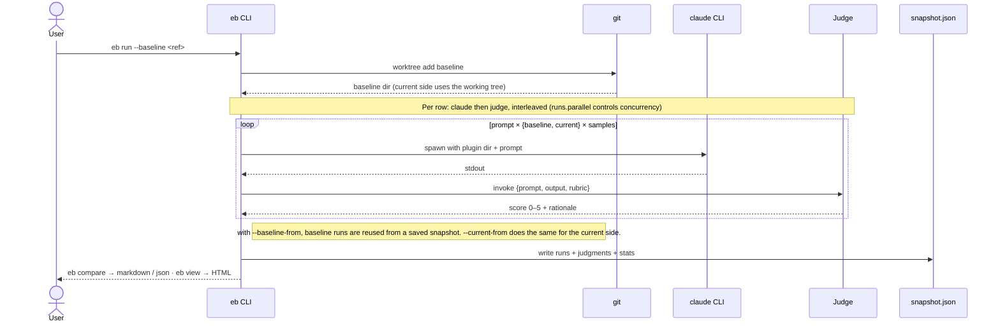
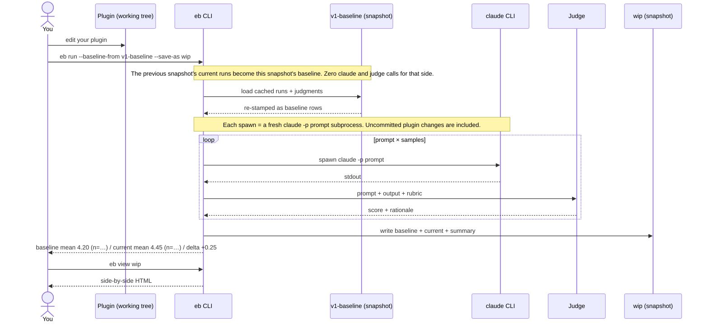
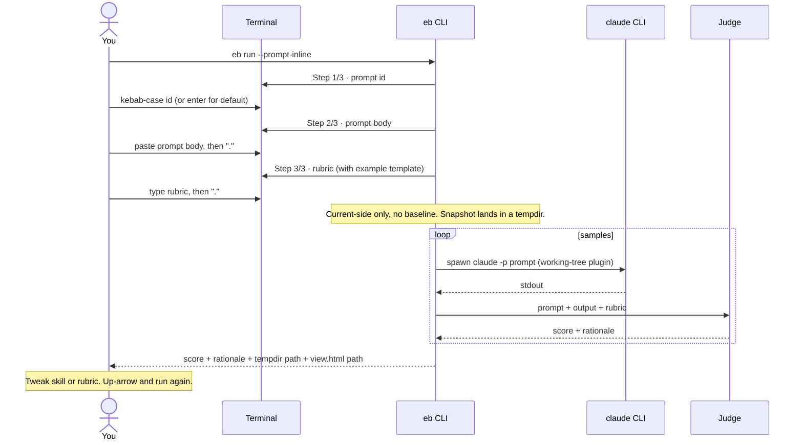

# eval-bench

Benchmark Claude Code plugins by A/B comparing plugin versions with LLM-judged evaluation prompts.

Runs a fixed set of prompts against two versions of your plugin (baseline vs current), invokes the real `claude` CLI so skills, MCP servers, subagents, slash commands, and hooks actually load, grades each output with a configurable judge (local Ollama, the `claude` CLI itself, Anthropic, OpenAI, OpenRouter, GitHub Models, or any OpenAI-compatible endpoint), and produces a side-by-side comparison.

## How it works



The provider (`claude` CLI) and judge are independent — the judge never sees `claude`, only the captured output and your rubric. Judges are pluggable (Ollama, Anthropic, OpenAI, OpenAI-compatible, OpenRouter, GitHub Models, or the local `claude` CLI as judge); most are HTTP-backed, `claude-cli` shells out.

## Install

```bash
npm i -g eval-bench
# or
npx eval-bench --help
```

Requires:
- Node 20+
- `claude` CLI on PATH ([install instructions](https://docs.anthropic.com/claude-code))
- Your plugin in a git repo (required for baseline checkout via `git worktree`)
- A judge: local Ollama, the `claude` CLI itself, or an API key for Anthropic / OpenAI / OpenRouter / GitHub Models / any OpenAI-compatible endpoint (see [docs/judges.md](docs/judges.md))

**Note:** You don't need a full plugin structure—if you only have standalone `skills/*.md` or `agents/*.md` files without `.claude-plugin/plugin.json`, eval-bench will automatically create a temporary minimal plugin manifest for you.

## Quickstart

```bash
cd my-claude-plugin

# scaffold .eval-bench/ (config, prompts template, snapshots dir)
eb init

# write your eval prompts and rubrics
$EDITOR .eval-bench/prompts.yaml

# freeze a reference snapshot at a known-good ref. This becomes the
# starting point for the rolling-baseline workflow below.
eb eval --ref v1.0.0 --save-as v1-baseline
```

From here you'll typically use one of three workflows. Pick by what you're trying to do.

### Workflow A — rolling baseline (the common case)

You changed something in the plugin and want to know if it regressed quality vs the last accepted snapshot. The previous snapshot's `current` runs become this snapshot's `baseline` — zero claude calls and zero judge calls for that side, so you only pay for the current ref:



```bash
# Make a change in your plugin, then:
eb run --baseline-from v1-baseline --save-as wip
eb view wip
```

Δ is `current.mean − baseline.mean`. Scores are 0–5 from the judge; means are arithmetic averages across all (prompt × samples) runs. Once `wip` looks good, it becomes the next iteration's `--baseline-from` argument — there's no separate "promote" command.

### Workflow B.1 — iterate on one prompt or rubric

Use this when one of your committed prompts regressed (or never scored well) and you want a tight fix-and-rerun loop on just that prompt — without paying for the full matrix on every iteration. Pair `--only` with `--no-save` so iterating doesn't pile up directories under your configured `snapshots.dir`:

```mermaid
sequenceDiagram
    actor You
    participant prompts as prompts.yaml
    participant eb as eb CLI
    participant prev as v1-baseline (snapshot)
    participant claude as claude CLI
    participant judge as Judge
    participant tmp as tempdir ($TMPDIR/eb-ephemeral-…)

    You->>prompts: edit one prompt + rubric
    You->>eb: eb run --baseline-from v1-baseline --only id --no-save

    Note over eb,prev: --only filters cached baseline to just this prompt
    eb->>prev: load cached baseline runs for id (one per sample)
    prev-->>eb: cached runs + judgments

    Note over eb,tmp: --no-save writes to a fresh tempdir. Your configured snapshots.dir is untouched.
    loop samples
        eb->>claude: spawn claude -p prompt (working-tree plugin)
        claude-->>eb: stdout
        eb->>judge: prompt + output + rubric
        judge-->>eb: score + rationale
    end
    eb->>tmp: write snapshot.json + view.html + per-row outputs
    eb-->>You: per-row score + rationale + view.html path

    Note over You: Read rationale or open view.html. Fix skill or rubric. Run again.
    You->>eb: same command, again
    Note over eb,tmp: Fresh tempdir each run. OS reclaims $TMPDIR on reboot (Linux /tmp; macOS /var/folders).
```

```bash
eb run --baseline-from v1-baseline --only find-user-by-email --no-save
```

Each row's score + rationale prints to stdout so you can read *why* a row scored what it did without opening the HTML. To see the actual model output, open the `view.html` path the CLI prints at the end (or paste the `eb view <name> --snapshot-dir <tempdir>` line). When you're happy, run once with `--save-as <name>` to capture the new state for workflow A.

### Workflow B.2 — throwaway rubric, no commit

Use this when you want to try a prompt + rubric without committing it to `prompts.yaml` — exploring a new test path, sanity-checking whether your rubric actually scores answers the way you intended, or sketching before deciding what's worth keeping. `--prompt-inline` reads one prompt + rubric interactively from your terminal:



```bash
eb run --prompt-inline
```

The interactive flow shows a working rubric template inline (sub-criteria with point caps, plus a penalty line) so you don't have to read `docs/rubrics.md` before sketching one. After the run, the CLI prints the path to `view.html` and an `eb view --snapshot-dir <tempdir>` form so you can inspect the actual model outputs, not just the judge's summary.

### Other recipes

```bash
# CI gating — A/B two refs in one shot, fail if regression > threshold
eb run --baseline-from v1-baseline --save-as wip \
       --compare v1-baseline --fail-on-regression 0.5

# already have an `eb eval` snapshot at HEAD? promote it to a dual-variant
# snapshot by stitching it against the saved baseline — no fresh claude runs,
# both `eb compare` and `eb view` work
eb run --baseline-from v1-baseline --current-from wip --save-as wip-vs-v1

# a few rows failed yesterday (judge timeout, quota)? re-run only those
eb run --baseline main --save-as baseline --retry-failed

# changed the judge in eval-bench.yaml? re-score cached Claude outputs
# without re-running Claude — answers "did the new judge change the verdict?"
eb run --save-as wip --rejudge

# override the wrapping judge prompt for one run — useful for prompt-engineering
# the judge itself before committing to a new template in eval-bench.yaml
eb run --save-as wip --judge-template "$(cat my-judge.txt)"
# (or persist it: set judge.template in .eval-bench/eval-bench.yaml)

# diagnose a slow / stuck judge — writes a per-invocation debug log under
# .eval-bench/snapshots/<name>/debug-<ts>.log with full HTTP bodies and
# Ollama timing fields, plus a colorized stderr mirror
eb run --baseline main --save-as baseline --debug
```

See [docs/judges.md#customizing-the-judge-prompt](docs/judges.md#customizing-the-judge-prompt) for the verbatim default judge template, the placeholder rules, and worked examples.

Full walkthrough: [docs/quickstart.md](docs/quickstart.md).

## Docs

- [docs/quickstart.md](docs/quickstart.md) — zero to first comparison in ten minutes
- [docs/concepts.md](docs/concepts.md) — plugin, baseline, variant, sample, judge, rubric, snapshot
- [docs/config.md](docs/config.md) — every field in `.eval-bench/eval-bench.yaml` and `.eval-bench/prompts.yaml`
- [docs/rubrics.md](docs/rubrics.md) — how to write rubrics that produce reliable scores
- [docs/judges.md](docs/judges.md) — picking a judge; local vs hosted tradeoffs; known-good models
- [docs/ci.md](docs/ci.md) — GitHub Actions, GitLab CI, self-hosted GPU runners
- [docs/troubleshooting.md](docs/troubleshooting.md) — common failure modes
- [docs/comparison-to-promptfoo.md](docs/comparison-to-promptfoo.md) — when to use this tool vs raw Promptfoo

## License

MIT.
